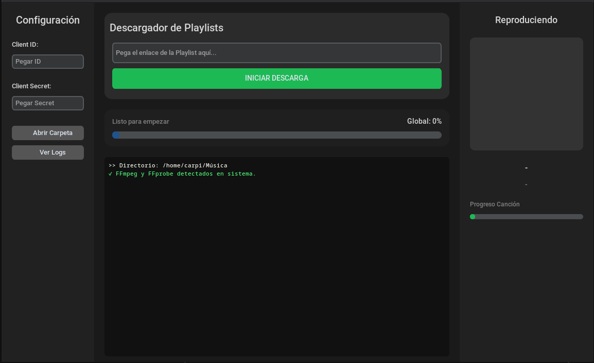

# **Spotify → MP3 Downloader**

**Spotify → MP3 Downloader** es una aplicación de escritorio para Windows y Linux que te permite descargar playlists de Spotify como archivos MP3, con portada y metadatos, usando YouTube como fuente de audio.

###**Nota: Requiere tener claves en  para descargar las canciones.**

## **Características**

* Descarga playlists completas de Spotify.  
* Convierte automáticamente a MP3 con metadatos y portada.  
* Vista previa de la canción actual y progreso de descarga.  
* Soporte para Windows y Linux.  
* Descarga automática de FFmpeg si no está instalado.  
* Interfaz moderna con **CustomTkinter**.  
* Logs de descargas y errores.

## **Requisitos**

* Python 3.10+  
* Librerías Python:  
  * `customtkinter`  
  * `spotipy`  
  * `yt_dlp`  
  * `Pillow`  
  * `requests`  
* Conexión a Internet para descargas y autenticación de Spotify.

## **Instalación**

### **Opción 1: Ejecutar con Python**

git clone \  
cd spotify-to-mp3 
pip install \-r requirements.txt  
python main.py

### **Opción 2: Ejecutable (.exe)**

1. Ve a la carpeta `/dist` después de haber compilado con PyInstaller.  
2. Ejecuta `SpotifyDownloader.exe`.

## **Uso**

1. Introduce tu **Client ID** y **Client Secret** de Spotify.  
2. Pega el enlace de la playlist que quieras descargar.  
3. Haz clic en **INICIAR DESCARGA**.  
4. La aplicación descargará cada canción como MP3 en `~/Música` (puedes cambiarlo en el código).

## **Estructura de Archivos**

SpotifyDownloader/  
├─ main.py          \# Archivo principal  
├─ dist/            \# Ejecutables compilados  
├─ LICENSE          \# Licencia GPL 2.1  
├─ README.md  
├─ requirements.txt \# Dependencias Python  
└─ screenshots/     \# Imágenes para README

## **Nota sobre FFmpeg**

Si FFmpeg no está instalado en tu sistema, la aplicación descargará automáticamente los binarios necesarios y los pondrá en el directorio actual.

## **Contribuciones**

Se aceptan contribuciones mediante pull requests. Por favor, crea una issue antes de implementar cambios importantes.

